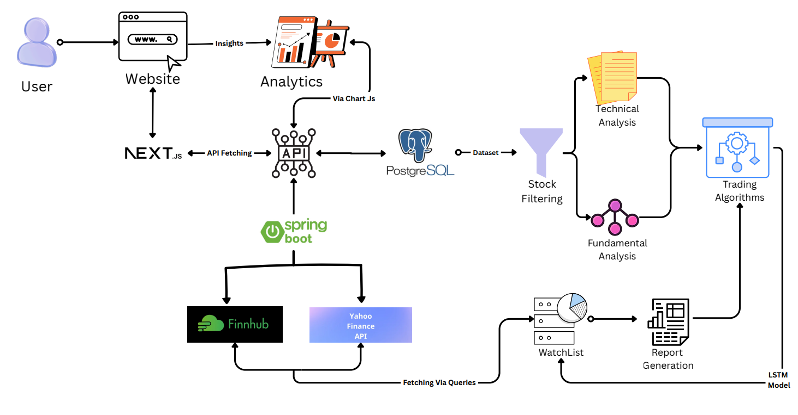

# 📈 Portfolio Management & Stock Analytics Platform

A full-stack **financial portfolio management and analytics platform** built using modern web and backend technologies.  
The application enables users to track their investment portfolio, visualize market performance, and generate predictive insights using machine learning.

This project was developed as part of a **training capstone**, with a strong focus on **API design, clean architecture, scalability, and real-world data integration**.

---

## 🧩 High-Level Overview

The platform is composed of three major components:

1. **Frontend** – Next.js + Chart.js (deployed on Vercel)
2. **Backend API** – Spring Boot REST API (deployed on Render)
3. **Prediction Service** – Python FastAPI with LSTM model (deployed on Render)

All persistent data is stored in **PostgreSQL (Neon Database)**.

---

## 🏗️ System Architecture

### Key Architectural Decisions
- **Frontend never calls third-party APIs directly**
- **Spring Boot acts as the API Gateway**
- **External market data is normalized and cached**
- **Machine Learning logic is isolated in FastAPI**

---

## ✨ Features

### 📊 Portfolio Management
- Add and remove holdings
- View asset allocation
- Real-time portfolio valuation
- Profit/Loss calculations

### 📈 Market Data Visualization
- Historical price charts (Chart.js)
- Volume analysis
- Technical indicators (SMA, EMA)
- Interactive time-range selection

### 📉 Performance Analytics
- Portfolio performance over time
- Benchmark comparison
- Risk metrics (volatility, drawdown)
- Returns distribution

### 🧠 Stock Prediction & Insights
- LSTM-based price prediction
- Predicted vs actual price charts
- Trend direction & confidence scoring
- Insight cards with disclaimers

### 📰 Market Insights
- Sector performance overview
- Trending stocks
- Volume movers
- Market news (optional/mock data)

---

## 🛠️ Tech Stack

### Frontend
- **Next.js (App Router)**
- **TypeScript**
- **Chart.js**
- Tailwind CSS / modern CSS
- Deployed on **Vercel**

### Backend
- **Spring Boot**
- RESTful API design
- **PostgreSQL (Neon DB)**
- Flyway migrations
- Deployed on **Render**

### Machine Learning
- **Python FastAPI**
- LSTM model for stock prediction
- Alpha Vantage historical data
- Deployed on **Render**

### External APIs
- **Alpha Vantage API**
- **Yahoo Finance API**

---

## 📁 Project Structure

- `/frontend` – Next.js application
- `/backend` – Spring Boot REST API

---

## 🧠 Data Integration Strategy

| Data Type | Source |
|---------|-------|
| Real-time price | Yahoo Finance |
| Historical prices | Alpha Vantage |
| Technical indicators | Alpha Vantage |
| Company fundamentals | Yahoo Finance |
| Predictions | FastAPI (LSTM) |

All data is:
- Normalized in Spring Boot
- Cached to avoid rate limits
- Exposed via clean REST APIs

---